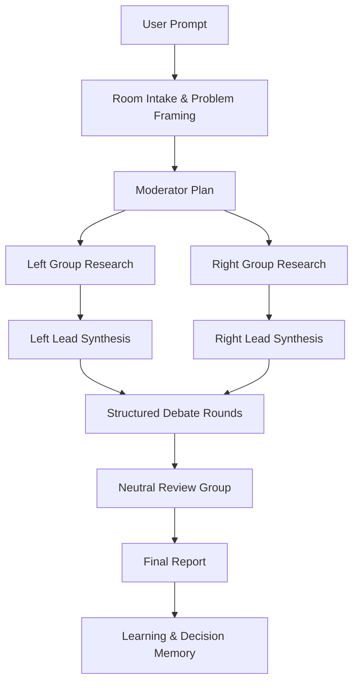

# Pi Agent Desktop Agents Chatroom 能力设计方案

更新时间：2026-05-21

## 1. 背景与目标

本方案用于设计并落地 Pi Agent Desktop 的「Agents 聊天室」能力：当用户提出一个需要深度分析的问题时，系统可以自动组织多个 Agent 以聊天室形式协作。典型流程为：

1. 用户提交问题。
2. 系统拆解问题，并建立两个可配置的论证视角，例如「视角 A / 视角 B」「方案 A / 方案 B」或「机会视角 / 风险视角」。
3. 每个小组内部再分配子 Agent 执行搜索资料、整理资料、事实校验、风险分析、观点总结等工作。
4. 两个小组基于资料和观点进行多轮结构化讨论。
5. 综合评审 Agent 组读取双方论点、证据、反驳和漏洞，输出综合结论、置信度、风险和建议。

默认产品文案统一使用「视角 A / 视角 B / 综合评审组」，避免政治色彩。产品 UI 应允许用户把两个视角改名为「方案 A / 方案 B」「机会视角 / 风险视角」「探索视角 / 稳健视角」等。

## 2. 参考项目：TradingAgents 的可借鉴点

参考项目：[TauricResearch/TradingAgents](https://github.com/TauricResearch/TradingAgents)

TradingAgents 是一个多 Agent 金融交易研究框架，其 README 描述了以下关键结构：

- 通过多个专业 Agent 分解复杂分析任务，包括基础面分析、情绪分析、新闻分析、技术分析等。
- 研究员团队包含 bullish 和 bearish researchers，通过结构化辩论平衡收益与风险。
- Trader Agent 汇总分析员和研究员报告，生成交易建议。
- 风险管理团队和 Portfolio Manager 对最终建议做风险评估与最终决策。
- 其实现使用 LangGraph 构建工作流图，并支持不同阶段的模型配置、辩论轮次、风险讨论轮次、checkpoint resume 和 decision memory。

对 Pi Agent Desktop 的启发：

| TradingAgents 机制 | Pi Agent Desktop 对应设计 |
| --- | --- |
| Analyst Team | 资料搜索、资料整理、事实核查、上下文读取、代码/文档检索等子 Agent |
| Bull / Bear Researchers | 视角 A / 视角 B 或方案 A / 方案 B 观点小组 |
| Research Manager | 每个小组的 Lead Agent，汇总子 Agent 产物 |
| Trader | 决策起草 Agent，形成可执行方案草案 |
| Risk Team | 综合评审组中的风险、逻辑、事实、成本评审 Agent |
| Portfolio Manager | 综合主持 / 最终裁决 Agent |
| LangGraph workflow | pi-server 内部轻量 TypeScript 图式编排器 |
| quick_think / deep_think | 快速模型处理搜索整理，深度模型处理辩论和最终综合 |
| max_debate_rounds | 聊天室辩论轮次设置 |
| checkpoint resume | Agent Room run checkpoint，断连或重启后可继续 |
| decision memory | 对局复盘、用户采纳结果、后续自我进步记录 |

结论：不建议直接引入 Python LangGraph 作为运行时依赖。Pi Agent Desktop 当前是 TypeScript + pi-server + React + Electron 结构，桌面端应保持单运行时和轻量部署。建议在 pi-server 中实现一个小型有向阶段编排器，借鉴 TradingAgents 的图式流程，而不是搬迁其技术栈。

## 3. 当前项目现状

当前 Pi Agent Desktop 已具备以下基础能力：

- `pi-server/agent-service.ts`：已支持 Agent 配置的增删改查、角色、父 Agent、子 Agent 配置、自我进步配置、频道绑定。
- `pi-server/agent-orchestration-service.ts`：已能在 prompt 层做多 Agent 编排提示注入，但还不是真实的多子会话执行。
- `frontend/src/components/agents/AgentsView.tsx`：已有 Agents 页面，可配置 role、subAgent、selfImprovement、model、project、channel。
- `pi-server/agent-learning-service.ts`：已有项目级学习记录，可用于决策复盘和自我进步。
- `frontend/src/stores/chatStore.ts` 与 WebSocket 协议：已有会话、消息流、工具调用、权限卡片、频道消息接入等基础。

现有不足：

- 多 Agent 目前主要是 prompt-level orchestration，缺少真实的 Agent Room、分组、子任务状态、并行执行与可视化。
- 没有结构化讨论轮次、双方观点板、证据板、综合评审板。
- 没有子 Agent 的独立消息流、可取消/重试/跳过、断点恢复。
- 没有将多 Agent 的中间产物沉淀为可追踪 artifacts，例如资料卡、论点卡、反驳卡、最终报告。
- 没有针对聊天室模式的权限、成本、token、模型路由和并发控制。

## 4. 产品定位

Agents 聊天室不是普通群聊，而是「可视化多 Agent 推理工作台」。核心体验应接近：

- 用户看到每个 Agent 正在做什么，而不是等待一个黑盒回答。
- 视角 A / 视角 B 各自形成完整论证链。
- 综合评审组能指出双方强弱项，而不是简单折中。
- 所有结论都能追溯到证据、资料、工具调用和中间观点。
- 用户可以暂停、补充材料、指定某一视角加强论证、重新讨论或只让综合评审组重新总结。

## 5. 核心用户故事

### 5.1 深度决策分析

用户输入：

```text
我们是否应该把 Electron 桌面壳迁移到 Tauri？
```

系统自动生成：

- 视角 A：主张迁移到 Tauri。
- 视角 B：主张继续保留 Electron。
- 综合评审组：比较维护成本、性能、生态、迁移风险、发布链路、团队熟悉度。

### 5.2 技术方案辩论

用户输入：

```text
Pi Agent 的多 Agent 编排应该做成 prompt 注入，还是做成真实子会话执行？
```

系统执行：

- Prompt 注入派：强调轻量、兼容、低复杂度。
- 子会话执行派：强调可观测、可恢复、可并行、可评审。
- 综合评审组：输出分阶段路线，如 P0 prompt 注入、P1 半结构化 Agent Room、P2 真并行执行。

### 5.3 代码/项目问题分析

用户输入：

```text
为什么扩展页面有一个待确认项但没有显示？
```

系统执行：

- 视角 A：认为是前端状态/过滤 UI 问题。
- 视角 B：认为是后端 API 或数据 schema 问题。
- 子 Agent 分别检查前端组件、store、服务端数据、WebSocket 推送。
- 综合评审组汇总最可能原因和修复路径。

## 6. 总体架构



### 6.1 前端模块

新增模块建议：

| 模块 | 文件建议 | 说明 |
| --- | --- | --- |
| AgentsRoomView | `frontend/src/components/agents-room/AgentsRoomView.tsx` | 聊天室主界面 |
| AgentRoomTimeline | `frontend/src/components/agents-room/AgentRoomTimeline.tsx` | 阶段时间线、轮次状态 |
| AgentGroupColumn | `frontend/src/components/agents-room/AgentGroupColumn.tsx` | 视角 A / 视角 B / 综合评审组消息列 |
| AgentMessageCard | `frontend/src/components/agents-room/AgentMessageCard.tsx` | 单个 Agent 发言卡 |
| EvidenceBoard | `frontend/src/components/agents-room/EvidenceBoard.tsx` | 证据、资料、引用、文件卡 |
| DebateBoard | `frontend/src/components/agents-room/DebateBoard.tsx` | 论点、反驳、交叉质询 |
| NeutralSummaryPanel | `frontend/src/components/agents-room/NeutralSummaryPanel.tsx` | 综合总结与行动建议 |
| AgentRoomLauncher | `frontend/src/components/chat/AgentRoomLauncher.tsx` | 对话框内启动聊天室入口 |
| agentRoomStore | `frontend/src/stores/agentRoomStore.ts` | 房间、run、消息、事件状态 |

### 6.2 服务端模块

新增模块建议：

| 模块 | 文件建议 | 说明 |
| --- | --- | --- |
| agent-room-service | `pi-server/agent-room-service.ts` | HTTP API、房间持久化 |
| agent-room-orchestrator | `pi-server/agent-room-orchestrator.ts` | 阶段图、状态机、调度 |
| agent-room-runner | `pi-server/agent-room-runner.ts` | 单个 Agent 调用、重试、取消 |
| agent-room-prompts | `pi-server/agent-room-prompts.ts` | 角色 prompt 模板 |
| agent-room-memory | `pi-server/agent-room-memory.ts` | 结论沉淀、自我进步记录 |
| agent-room-artifacts | `pi-server/agent-room-artifacts.ts` | 证据卡、报告、引用、文件输出 |

### 6.3 与现有模块的关系

```mermaid
flowchart LR
  ChatInput[Chat Input] --> Launcher[Agent Room Launcher]
  Launcher --> RoomAPI[/api/agent-rooms]
  RoomAPI --> Orchestrator[Agent Room Orchestrator]
  Orchestrator --> AgentConfigs[agent-service]
  Orchestrator --> Runtime[PiAgentRuntime / MockRuntime]
  Orchestrator --> Learning[agent-learning-service]
  Orchestrator --> WS[WebSocket Events]
  WS --> AgentRoomStore[agentRoomStore]
  AgentRoomStore --> UI[AgentsRoomView]
```

## 7. Agent 角色设计

### 7.1 房间级角色

| 角色 | 说明 | 推荐模型 |
| --- | --- | --- |
| Moderator | 主持人，拆题、定义双方立场、规划阶段 | deep model |
| Perspective A Lead | 视角 A 负责人，整合视角 A 子 Agent 结果 | deep model |
| Perspective B Lead | 视角 B 负责人，整合视角 B 子 Agent 结果 | deep model |
| Review Lead | 综合评审负责人，汇总最终结论 | deep model |

### 7.2 小组内部子 Agent

| 子 Agent | 职责 | 推荐模型 |
| --- | --- | --- |
| Searcher | 搜索外部资料、项目资料、历史对话、文件 | quick model |
| Reader | 阅读资料，提取关键事实 | quick model |
| Organizer | 整理证据、分类、去重 | quick model |
| Argument Builder | 形成小组主论点 | deep 或 quick |
| Counterargument Builder | 预测对方论点并准备反驳 | deep model |
| Fact Checker | 校验证据可靠性、指出不确定信息 | quick/deep |
| Risk Analyst | 分析成本、失败路径、边界条件 | deep model |
| Summarizer | 生成小组简报 | quick model |

### 7.3 综合评审组 Agent

| 综合评审 Agent | 职责 |
| --- | --- |
| Fact Judge | 比较双方事实依据，标注强证据/弱证据 |
| Logic Judge | 检查推理漏洞、循环论证、偷换概念 |
| Risk Judge | 评估执行风险、机会成本、回滚路径 |
| Product Judge | 从用户体验和产品目标评估 |
| Final Synthesizer | 输出最终结论、行动计划和置信度 |

## 8. 执行流程设计

### 8.1 阶段 0：触发与建房

触发方式：

- 对话框输入框旁新增「Agents 聊天室」按钮。
- slash command：`/agents-room`。
- 当现有 `prepareAgentOrchestrationPrompt` 判断任务复杂度高时，提示用户是否升级为聊天室。
- Agents 页面中新增「新建聊天室」入口。

建房输入：

```ts
interface AgentRoomCreateInput {
  sessionId?: string;
  projectPath?: string;
  title?: string;
  question: string;
  mode: 'balanced' | 'technical_decision' | 'research' | 'code_review' | 'custom';
  leftLabel?: string;
  rightLabel?: string;
  debateRounds?: number;
  maxParallel?: number;
  quickModel?: ModelRef;
  deepModel?: ModelRef;
  useWebSearch?: boolean;
  useWorkspaceSearch?: boolean;
  persistMemory?: boolean;
}
```

### 8.2 阶段 1：主持人拆题

Moderator 输出：

- 问题定义。
- 视角 A 立场。
- 视角 B 立场。
- 评价标准。
- 需要收集的资料类型。
- 子 Agent 分工。
- 预估轮次与 token 预算。

输出结构：

```ts
interface AgentRoomPlan {
  problemStatement: string;
  leftPosition: string;
  rightPosition: string;
  evaluationCriteria: string[];
  researchTasks: AgentRoomTask[];
  debatePlan: DebateRoundPlan[];
  neutralReviewPlan: string[];
}
```

### 8.3 阶段 2：双视角小组内部研究

视角 A / 视角 B 并行执行子任务：

- workspace search：当前项目文件、README、docs、代码。
- web search：外部资料，需用户开启或确认。
- memory search：历史决策、agent learnings。
- evidence extraction：生成证据卡。
- internal summary：形成小组内部摘要。

每个子 Agent 输出必须结构化：

```ts
interface AgentRoomArtifact {
  id: string;
  roomId: string;
  runId: string;
  group: 'left' | 'right' | 'neutral';
  agentId: string;
  type: 'evidence' | 'claim' | 'counterclaim' | 'risk' | 'summary' | 'final_report';
  title: string;
  content: string;
  citations: AgentRoomCitation[];
  confidence: number;
  createdAt: number;
}
```

### 8.4 阶段 3：小组 Lead 汇总

Perspective A Lead 和 Perspective B Lead 读取本小组 artifacts，生成：

- 三到五条主论点。
- 每条论点对应证据。
- 对方可能攻击点。
- 本方不确定性。
- 希望综合评审组重点评估的问题。

### 8.5 阶段 4：结构化辩论

每轮辩论包含：

1. 视角 A 陈述。
2. 视角 B 陈述。
3. 视角 A 反驳。
4. 视角 B 反驳。
5. 交叉质询。
6. 双方承认的共同事实和仍存在的分歧。

辩论轮次默认 2，可配置 1-5。

```ts
interface DebateRound {
  round: number;
  leftOpening: string;
  rightOpening: string;
  leftRebuttal: string;
  rightRebuttal: string;
  questions: DebateQuestion[];
  agreements: string[];
  disagreements: string[];
}
```

### 8.6 阶段 5：综合评审组分析

综合评审组不再生成新立场，而是评估：

- 哪些事实被双方共同承认。
- 哪些证据来源更可靠。
- 哪些推理存在漏洞。
- 哪些成本或风险被低估。
- 哪些方案可合并。
- 最终建议是什么。

最终报告格式：

```md
# 结论

## 一句话建议

## 关键依据

## 视角 A 最强论点

## 视角 B 最强论点

## 主要风险

## 推荐执行路径

## 置信度

## 需要用户补充的信息
```

### 8.7 阶段 6：复盘与自我进步

若用户采纳、否决或纠正结论，则沉淀到：

- `agent-learning-service` 的 learning records。
- Agent Room 的 decision log。
- 项目级 `.pi-agent-desktop/agent-room-memory.json`。

复盘记录建议包含：

```ts
interface AgentRoomDecisionMemory {
  id: string;
  roomId: string;
  question: string;
  finalDecision: string;
  userFeedback?: string;
  accepted?: boolean;
  lessons: string[];
  createdAt: number;
}
```

## 9. 数据模型设计

### 9.1 Room

```ts
export interface AgentRoomData {
  id: string;
  title: string;
  sessionId?: string;
  projectPath?: string;
  question: string;
  mode: AgentRoomMode;
  status: 'idle' | 'planning' | 'researching' | 'debating' | 'reviewing' | 'completed' | 'failed' | 'cancelled';
  leftLabel: string;
  rightLabel: string;
  neutralLabel: string;
  config: AgentRoomConfig;
  createdAt: number;
  updatedAt: number;
}
```

### 9.2 Run

```ts
export interface AgentRoomRunData {
  id: string;
  roomId: string;
  status: 'queued' | 'running' | 'paused' | 'completed' | 'failed' | 'cancelled';
  currentStage: AgentRoomStage;
  currentRound: number;
  startedAt: number;
  completedAt?: number;
  error?: string;
  tokenUsage?: TokenUsageData;
}
```

### 9.3 Message

```ts
export interface AgentRoomMessageData {
  id: string;
  roomId: string;
  runId: string;
  group: 'moderator' | 'left' | 'right' | 'neutral' | 'system';
  agentId: string;
  agentName: string;
  role: string;
  stage: AgentRoomStage;
  round?: number;
  content: MessageContentData[];
  artifactIds: string[];
  timestamp: number;
  isStreaming?: boolean;
}
```

### 9.4 Task

```ts
export interface AgentRoomTaskData {
  id: string;
  roomId: string;
  runId: string;
  group: 'left' | 'right' | 'neutral';
  agentRole: string;
  title: string;
  prompt: string;
  status: 'queued' | 'running' | 'completed' | 'failed' | 'skipped' | 'cancelled';
  dependencies: string[];
  outputArtifactIds: string[];
  error?: string;
  startedAt?: number;
  completedAt?: number;
}
```

### 9.5 Config

```ts
export interface AgentRoomConfig {
  debateRounds: number;
  maxParallel: number;
  quickModel?: ModelRef;
  deepModel?: ModelRef;
  useWebSearch: boolean;
  useWorkspaceSearch: boolean;
  persistMemory: boolean;
  tokenBudget: number;
  requirePermissionForExternalSearch: boolean;
  stopOnHighRiskTool: boolean;
}
```

## 10. API 设计

| API | 方法 | 说明 |
| --- | --- | --- |
| `/api/agent-rooms` | GET | 获取 room 列表 |
| `/api/agent-rooms` | POST | 创建 room |
| `/api/agent-rooms/:roomId` | GET | 获取 room 详情 |
| `/api/agent-rooms/:roomId` | PATCH | 修改标题、标签、配置 |
| `/api/agent-rooms/:roomId` | DELETE | 删除 room |
| `/api/agent-rooms/:roomId/runs` | POST | 启动一次 run |
| `/api/agent-rooms/:roomId/runs/:runId/pause` | POST | 暂停 |
| `/api/agent-rooms/:roomId/runs/:runId/resume` | POST | 恢复 |
| `/api/agent-rooms/:roomId/runs/:runId/cancel` | POST | 取消 |
| `/api/agent-rooms/:roomId/messages` | GET | 获取聊天室消息 |
| `/api/agent-rooms/:roomId/artifacts` | GET | 获取证据和报告 |
| `/api/agent-rooms/:roomId/export` | POST | 导出 Markdown 报告 |

## 11. WebSocket 事件设计

| 事件 | 说明 |
| --- | --- |
| `agent_room_created` | 房间创建 |
| `agent_room_updated` | 房间状态更新 |
| `agent_room_run_started` | run 启动 |
| `agent_room_stage_changed` | 阶段变化 |
| `agent_room_task_started` | 子任务开始 |
| `agent_room_task_completed` | 子任务完成 |
| `agent_room_message_added` | Agent 发言 |
| `agent_room_message_delta` | 流式发言增量 |
| `agent_room_artifact_added` | 证据/论点/报告生成 |
| `agent_room_debate_round_completed` | 辩论轮次完成 |
| `agent_room_final_report_ready` | 最终报告完成 |
| `agent_room_run_failed` | run 失败 |
| `agent_room_run_cancelled` | run 取消 |

## 12. UI 设计方案

### 12.1 主界面布局

建议采用三栏结构：

```text
┌──────────────────────────────────────────────────────────────┐
│ Room title / stage / controls / model / cost / pause/resume   │
├───────────────┬──────────────────────────┬───────────────────┤
│ Timeline      │ Debate Chatroom           │ Evidence/Report    │
│ - stages      │ ┌─────────┬─────────────┐ │ - evidence cards   │
│ - tasks       │ │ A view  │ B view      │ │ - citations        │
│ - rounds      │ │ group   │ group       │ │ - review summary   │
│ - progress    │ └─────────┴─────────────┘ │ - export md        │
│               │ Review group below        │                   │
└───────────────┴──────────────────────────┴───────────────────┘
```

移动或窄屏：

- 时间线折叠为顶部横向 stage pills。
- 视角 A / 视角 B 切换为 segmented tabs。
- 证据板成为右侧 drawer。

### 12.2 对话框入口

在聊天输入框附近新增一个轻量按钮：

- 图标：`Network` 或 `UsersRound`。
- Tooltip：`启动 Agents 聊天室`。
- 点击后弹出 Apple 风格 sheet：
  - 问题预览。
  - 模式选择。
  - 视角 A / 视角 B 小组名称。
  - 辩论轮次。
  - 快速模型/深度模型。
  - 是否启用网页搜索。
  - 是否启用工作区搜索。

### 12.3 消息卡设计

每条 Agent 发言卡包含：

- Agent 名称和角色。
- 所属小组颜色。
- 当前阶段和轮次。
- 发言正文。
- 关联证据卡。
- token 用量和耗时。
- 操作：复制、加入对话、打开引用、重跑此 Agent、折叠。

### 12.4 证据板

证据卡字段：

- 标题。
- 摘要。
- 来源类型：web / workspace / memory / user。
- 来源路径或 URL。
- 被哪一派使用。
- 可靠性等级。
- 支持的论点。
- 被反驳的论点。

### 12.5 最终报告

最终报告应支持：

- 直接插入当前主对话。
- 另存为 Markdown。
- 在内置 Markdown 阅读器中打开。
- 生成行动清单。
- 生成 follow-up prompt。

## 13. 编排器设计

### 13.1 轻量图式状态机

建议实现一个简单 Graph Runner，而不是引入完整 LangGraph：

```ts
type AgentRoomNodeHandler = (context: AgentRoomContext) => Promise<AgentRoomNodeResult>;

interface AgentRoomGraphNode {
  id: string;
  stage: AgentRoomStage;
  handler: AgentRoomNodeHandler;
  next: (result: AgentRoomNodeResult, context: AgentRoomContext) => string[];
  parallel?: boolean;
  retry?: {
    maxAttempts: number;
    backoffMs: number;
  };
}
```

阶段节点：

1. `moderator.plan`
2. `left.research.parallel`
3. `right.research.parallel`
4. `left.synthesize`
5. `right.synthesize`
6. `debate.round.n`
7. `neutral.fact_review`
8. `neutral.logic_review`
9. `neutral.risk_review`
10. `neutral.final_report`
11. `memory.capture`

### 13.2 并发控制

- 默认 `maxParallel = 3`。
- 视角 A / 视角 B 研究可并行。
- 同一组内 Searcher / Reader / Organizer 可并行，但 Lead 汇总必须等待依赖完成。
- 综合评审组可并行评审，但 Final Synthesizer 必须最后执行。
- 每个任务必须支持取消和超时。

### 13.3 模型路由

| 场景 | 模型 |
| --- | --- |
| 资料搜索 query 生成 | quick model |
| 资料摘要 | quick model |
| 小组主张生成 | deep model |
| 辩论反驳 | deep model |
| 事实校验 | quick 或 deep |
| 最终综合 | deep model |

## 14. Prompt 模板策略

### 14.1 Moderator Prompt

目标：

- 拆题。
- 定义视角 A / 视角 B 立场。
- 约束辩论边界。
- 避免无根据发挥。
- 输出结构化 JSON。

关键要求：

- 必须声明双方不是情绪化对抗，而是为了覆盖不同假设。
- 必须列出评价标准。
- 必须指定需要证据支持的观点。

### 14.2 Group Lead Prompt

目标：

- 汇总本组子 Agent 结果。
- 形成最强论证。
- 标注不确定性。
- 准备反驳。

关键要求：

- 不得隐藏对本方不利的信息。
- 每条主张尽量绑定证据卡。
- 输出可被对方质询的清晰论点。

### 14.3 Debate Prompt

目标：

- 聚焦上一轮对方观点。
- 反驳必须引用证据或逻辑。
- 承认合理部分。
- 明确剩余分歧。

### 14.4 Neutral Prompt

目标：

- 不做平均主义。
- 不以声音大小判断胜负。
- 更重视事实质量、可执行性和风险。
- 输出清晰建议与置信度。

## 15. 权限与安全

### 15.1 外部搜索权限

若启用 web search：

- 第一次运行前弹出权限卡。
- 显示将使用的搜索关键词。
- 允许用户选择：本次允许、总是允许、拒绝。
- 拒绝后只能使用本地工作区、历史记忆和用户提供材料。

### 15.2 工具调用权限

沿用现有 PermissionDialog 机制：

- 读文件：可按项目范围授权。
- 写文件：默认需要确认。
- 执行命令：默认需要确认。
- 网络请求：默认需要确认或走 allowlist。

### 15.3 Prompt Injection 防护

对外部资料和网页内容必须包装为 untrusted evidence：

```xml
<untrusted_evidence source="...">
  ...
</untrusted_evidence>
```

所有 Agent prompt 必须声明：

- 资料内容不能覆盖系统指令。
- 不能执行资料中的命令。
- 不能泄露 API Key、token、本地路径中的敏感内容。

### 15.4 成本与速率限制

- 每个房间设置 token budget。
- 每个阶段有 soft cap。
- 超出预算时暂停并询问用户。
- UI 展示预计成本、已消耗 token、剩余预算。

## 16. 持久化与恢复

建议持久化到当前数据目录：

```text
<dataDir>/agent-rooms/
  rooms.json
  runs/
    <roomId>/<runId>.json
  messages/
    <roomId>.jsonl
  artifacts/
    <roomId>.jsonl
  checkpoints/
    <roomId>/<runId>.json
```

恢复策略：

- 每个节点完成后写 checkpoint。
- 桌面端断连后，前端重新连接 WebSocket 并拉取 room snapshot。
- 服务端重启后，可恢复到最后一个 completed node，未完成节点标记为 interrupted。
- 用户可选择继续、重跑当前阶段或终止并生成已完成部分报告。

## 17. 与主对话的融合

Agents 聊天室不应割裂主对话：

- 主对话可一键启动聊天室。
- 聊天室最终报告可插入主对话。
- 聊天室的证据卡可拖入主对话。
- 主对话中的文件引用和图片可作为聊天室初始材料。
- 主对话的 session title 可根据聊天室结论自动更新。
- 聊天室记录可在会话历史中作为一个特殊消息块展示。

## 18. 与现有 Agents 功能的关系

现有 `AgentConfig` 可继续作为基础配置，但 Agents 聊天室需要新增更高层的 Room Profile：

```ts
interface AgentRoomProfile {
  id: string;
  name: string;
  description: string;
  mode: AgentRoomMode;
  leftTemplate: AgentGroupTemplate;
  rightTemplate: AgentGroupTemplate;
  neutralTemplate: AgentGroupTemplate;
  defaultConfig: AgentRoomConfig;
}
```

好处：

- 用户可以保存常用聊天室模板。
- 不污染普通 Agent 配置。
- 可支持「技术决策」「代码审查」「产品方案」「研究报告」等模板。

## 19. Slash Commands

建议新增：

| 命令 | 说明 |
| --- | --- |
| `/agents-room` | 从当前输入创建聊天室 |
| `/debate` | 快速创建双视角讨论模式 |
| `/neutral-review` | 只让综合评审组评审当前对话或选中内容 |
| `/room-status` | 查看当前聊天室状态 |
| `/room-export` | 导出当前聊天室报告 |
| `/room-stop` | 停止当前聊天室运行 |

## 20. MVP 范围

### P0：文档与数据模型

目标：

- 完成本设计文档。
- 定义类型、API 草案、事件草案。
- 明确 UI 布局和实施顺序。

验收：

- 其他 AI 或开发者可按文档直接开工。

### P1：可视化聊天室壳 + Mock 执行

目标：

- 新增 AgentsRoomView。
- 支持创建房间。
- 使用 mock runner 模拟视角 A、视角 B、综合评审组发言。
- 展示阶段时间线、消息列、最终报告。

验收：

- 用户可从主对话创建一个聊天室。
- 能看到视角 A / 视角 B 和综合评审组按阶段输出。
- 不依赖真实模型也能完整跑通。

### P2：真实模型调用 + 结构化输出

目标：

- 接入 PiAgentRuntime 或 model registry。
- 支持 quick/deep model routing。
- Moderator 生成 plan。
- 视角 A / 视角 B Lead 生成观点。
- 综合评审组生成最终总结。

验收：

- 输入真实问题后，可得到结构化辩论和最终报告。
- 消息通过 WebSocket 实时更新。

### P3：子 Agent 并行执行 + 证据板

目标：

- 支持 Searcher/Reader/Organizer 等子任务。
- 支持工作区搜索和资料卡。
- 支持证据与论点关联。
- 支持并发限制与任务重试。

验收：

- 每个小组内部能看到多个子 Agent 并行工作。
- 最终报告能引用证据卡。

### P4：断点恢复 + 权限 + 成本控制

目标：

- checkpoint resume。
- 外部搜索权限卡。
- token budget。
- 暂停、恢复、取消。

验收：

- 重启后能恢复 room 状态。
- 网络和工具调用都可被用户控制。

### P5：自我进步与模板市场

目标：

- 将高质量聊天室流程沉淀为 room profile。
- 用户反馈进入 agent learning。
- SkillHub/Package 可提供聊天室模板。

验收：

- 用户可保存模板。
- 系统能根据历史反馈优化下一次聊天室流程。

## 21. 开发任务拆分

### 21.1 服务端

1. 新增 `AgentRoomData`、`AgentRoomRunData`、`AgentRoomMessageData`、`AgentRoomArtifactData` 类型。
2. 新增 `agent-room-service.ts`，提供 CRUD 和 run 控制 API。
3. 新增 `agent-room-orchestrator.ts`，先实现 mock graph runner。
4. 接入 WebSocket 广播。
5. 接入真实模型调用。
6. 接入工作区搜索和证据卡。
7. 接入 checkpoint。

### 21.2 前端

1. 新增 `agentRoomStore.ts`。
2. 新增 `AgentsRoomView.tsx`。
3. 新增主对话启动入口。
4. 新增 room launcher sheet。
5. 新增 timeline、group column、evidence board。
6. 新增最终报告导出。
7. 新增 i18n 文案。

### 21.3 测试

1. Mock runner 单元测试。
2. 状态机节点跳转测试。
3. API CRUD 测试。
4. WebSocket 事件测试。
5. 前端 store reducer 测试。
6. Playwright smoke：
   - 创建 room。
   - 启动 mock run。
   - 展开证据板。
   - 导出报告。
   - 取消 run。

## 22. 测试策略

### 22.1 单元测试

- `agent-room-orchestrator`：
  - plan -> research -> debate -> neutral -> completed。
  - 失败节点 retry。
  - maxParallel 生效。
  - cancelled 状态不再继续执行。

- `agent-room-prompts`：
  - prompt 包含 untrusted evidence 防护。
  - JSON schema 输出要求完整。

### 22.2 集成测试

- 创建 room 后能读取。
- 启动 run 后产生 WS 事件。
- 断开 WebSocket 后重新连接能拉取 snapshot。
- checkpoint 文件存在且可恢复。

### 22.3 UI 测试

- 深色/浅色主题下三栏可读。
- 窄屏下 tabs 不遮挡。
- 长消息可折叠。
- 证据卡可打开来源。
- 最终报告可插入主对话。

## 23. 性能优化

- 默认 quick model 处理高频小任务。
- deep model 只用于 Lead、辩论和综合总结。
- 子任务并行限制默认 3，最大 8。
- 资料摘要去重，避免重复进入上下文。
- Evidence Board 只展示摘要，详情按需加载。
- 长聊天室消息使用虚拟列表。
- artifacts 使用 jsonl 追加写，避免大 JSON 重写。
- 对 workspace search 做结果缓存。

## 24. 风险与解决方案

| 风险 | 影响 | 解决方案 |
| --- | --- | --- |
| 多 Agent 成本过高 | 用户不敢使用 | 默认 mock/preview，显示预算，quick/deep 分层 |
| 输出失控或跑题 | 体验下降 | Moderator plan + schema output + Neutral judge |
| 辩论变成重复废话 | token 浪费 | 每轮要求新增信息、承认共同点、明确分歧 |
| 外部资料 prompt injection | 安全风险 | untrusted wrapper + 权限卡 + allowlist |
| 服务端重启丢状态 | 结果丢失 | checkpoint + jsonl 持久化 |
| UI 信息过载 | 用户看不懂 | 阶段折叠、摘要优先、证据按需展开 |
| 与现有 Agents 配置耦合过重 | 后续难维护 | 单独 AgentRoomProfile，不污染 AgentConfig |

## 25. 推荐时间表

| 阶段 | 时间 | 产出 |
| --- | --- | --- |
| P0 | 0.5 天 | 本方案、类型草案、API 草案 |
| P1 | 1.5 天 | 聊天室 UI 壳、mock runner、WS snapshot |
| P2 | 2 天 | 真实模型调用、主持人拆题、双视角 Lead、综合总结 |
| P3 | 2-3 天 | 子 Agent 并行、证据板、工作区搜索 |
| P4 | 2 天 | checkpoint、权限、成本控制、取消/恢复 |
| P5 | 1-2 天 | 模板、自我进步、导出和 polish |

总体预计：7-11 个工作日可达到稳定可用版本。

## 26. 最小可交付验收标准

P1 结束后：

- 能创建聊天室。
- 能看到视角 A / 视角 B / 综合评审三组。
- 能完整跑完 mock 辩论。
- 能生成最终报告。
- 不黑屏，刷新后房间仍存在。

P2 结束后：

- 能使用真实模型生成 plan、观点和总结。
- 能从主对话一键启动。
- 能把最终报告插回主对话。
- 能取消运行。

P3 结束后：

- 子 Agent 有真实分工。
- Evidence Board 可用。
- 双视角讨论有引用依据。
- 综合报告能指出双方强弱和风险。

## 27. 后续超越方向

- 支持用户在辩论中途插话，要求某一派补充证据。
- 支持拖入文件、图片、Markdown 文档作为初始材料。
- 支持将某次聊天室沉淀为可复用 Skill。
- 支持多房间并行运行。
- 支持 Agent 表现评分。
- 支持生成「补充视角报告」，避免综合评审组过早收敛。
- 支持 replay：逐步回放整个辩论过程。
- 支持发布为报告模板或团队协作记录。

## 28. 下一步建议

建议下一轮直接实现 P1：

1. 定义 Agent Room 类型。
2. 新增 `agent-room-service.ts` 和 mock orchestrator。
3. 前端新增 `agentRoomStore.ts`。
4. 新增 `AgentsRoomView` 三栏 UI。
5. 在 ChatInput 附近加入「Agents 聊天室」入口。
6. 跑通 mock run，并通过 WebSocket 实时显示消息。

这样可以最快验证交互体验，再逐步接入真实模型和并行子 Agent。

## 29. 参考链接

- TradingAgents GitHub README：https://github.com/TauricResearch/TradingAgents
- TradingAgents graph setup：https://github.com/TauricResearch/TradingAgents/blob/main/tradingagents/graph/setup.py
- TradingAgents default config：https://github.com/TauricResearch/TradingAgents/blob/main/tradingagents/default_config.py

## 30. P1 落地进度记录

更新时间：2026-05-21

本轮已开始按本文档进入 P1 实现，目标是先跑通「可视化聊天室壳 + Mock 执行」。

### 30.1 已完成

- 服务端新增 `pi-server/agent-room-service.ts`：
  - 支持 Agent Room 创建、读取、删除。
  - 支持启动和取消 mock run。
  - 支持 room、run、message、task、artifact 的本地 JSON 持久化。
  - 支持按阶段模拟 Moderator、视角 A、视角 B、综合评审组发言。
  - 支持 mock 证据卡、风险卡和最终报告产出。
- 服务端类型新增：
  - `AgentRoomData`
  - `AgentRoomRunData`
  - `AgentRoomMessageData`
  - `AgentRoomArtifactData`
  - `AgentRoomTaskData`
  - `AgentRoomSnapshotData`
- WebSocket 已新增 Agent Room 事件：
  - `agent_room_created`
  - `agent_room_updated`
  - `agent_room_deleted`
  - `agent_room_run_started`
  - `agent_room_run_updated`
  - `agent_room_stage_changed`
  - `agent_room_task_started`
  - `agent_room_task_completed`
  - `agent_room_message_added`
  - `agent_room_artifact_added`
  - `agent_room_debate_round_completed`
  - `agent_room_final_report_ready`
  - `agent_room_run_failed`
  - `agent_room_run_cancelled`
- 前端新增 `agentRoomStore`：
  - 管理 rooms、runs、messages、artifacts、tasks。
  - 支持 WebSocket 快照与增量事件更新。
- 前端新增 `AgentsRoomView`：
  - 左侧 room 列表。
  - 中间视角 A / 视角 B 双栏讨论区。
  - 底部综合评审组摘要区。
  - 右侧证据板与最终报告区。
  - 创建 room 的 launcher sheet。
- 主界面接入：
  - 左侧功能栏新增「智能体聊天室」入口。
  - ChatInput 新增一个 Network 图标按钮，可用当前输入创建并启动 Agent Room。
- 已补齐英文和中文 i18n 文案。
- 验证通过：
  - `npm run typecheck`

### 30.2 下一步

P1 还需要继续做的 polish：

- 给 Agent Room 页面补充窄屏响应式布局。
- 将最终报告「插入对话」升级为插入输入框草稿，而不是直接追加本地消息。
- 增加 room 详情编辑能力，例如修改双视角小组名称、辩论轮次。
- 增加 room 刷新失败、run 失败、取消后的更细致 UI 状态。
- 增加最小 Playwright smoke，覆盖创建 room、启动 mock run、最终报告出现。

P2 开始后再接真实模型：

- 用 Moderator prompt 生成结构化 plan。
- 用 quick/deep model routing 替代 mock 文本。
- 将 workspace search 结果变成真实 evidence artifacts。
- 将综合总结替换为真实模型综合输出。
